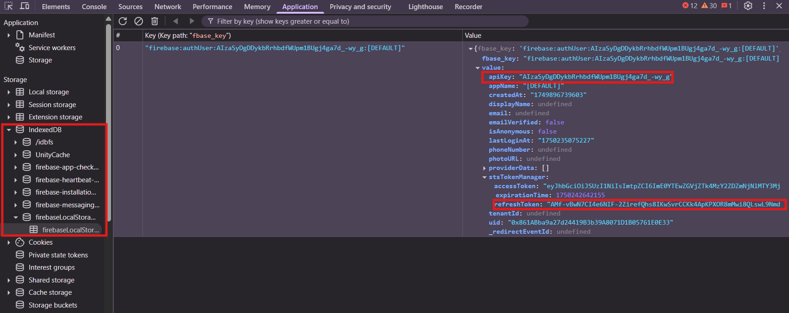

# 🤖 CraftWorld Auto Bot

Bot otomatis untuk menjalankan aktivitas harian di CraftWorld seperti:

- ✅ CLAIM_AREA (klaim semua area)
- ✅ START_FACTORY (nyalakan semua pabrik)
- ✅ UPGRADE_FACTORY (upgrade semua pabrik)
- ✅ CLAIM_MINE (ambil resource dari mine)
- ✅ UPGRADE_MINE (upgrade semua mine)
- ✅ START_MINE (nyalakan semua mine)

---

## 📦 Requirements

```bash
pip install -r requirements.txt
```

---

## ⚙️ Konfigurasi

Buat file `config.json` seperti ini:

```json
{
  "apiKey_1": "API_KEY_ANDA",
  "refresh_token_1": "REFRESH_TOKEN_ANDA"
}
```

Jika Anda menggunakan lebih dari 1 akun:

```json
{
  "apiKey_1": "API_KEY_AKUN_1",
  "refresh_token_1": "REFRESH_TOKEN_AKUN_1",
  "apiKey_2": "API_KEY_AKUN_2",
  "refresh_token_2": "REFRESH_TOKEN_AKUN_2"
}
```

---

## 🔐 Cara Mendapatkan `apiKey` dan `refresh_token`

1. Buka [CraftWorld Preview](https://preview.craft-world.gg/) dan login wallet Anda.
2. Buka **DevTools** di browser (`F12` atau klik kanan > Inspect).
3. Masuk ke tab **Application > Storage > IndexedDB > firebaseLocalStorageDb**.
4. Klik `firebaseLocalStorage`, cari key `fbase_key`.
5. Ambil `apiKey` dan `refreshToken` dari panel kanan.

📸 Contoh tampilan:


---

## ▶️ Menjalankan Bot

```bash
python craftworldv3_fixed.py
```

Bot akan otomatis menjalankan semua proses dan menyinkronkan data akun.

---

## 🧠 Credit

Dikembangkan oleh LYAMRIZZ | ROBI — untuk komunitas otomatisasi CraftWorld.

